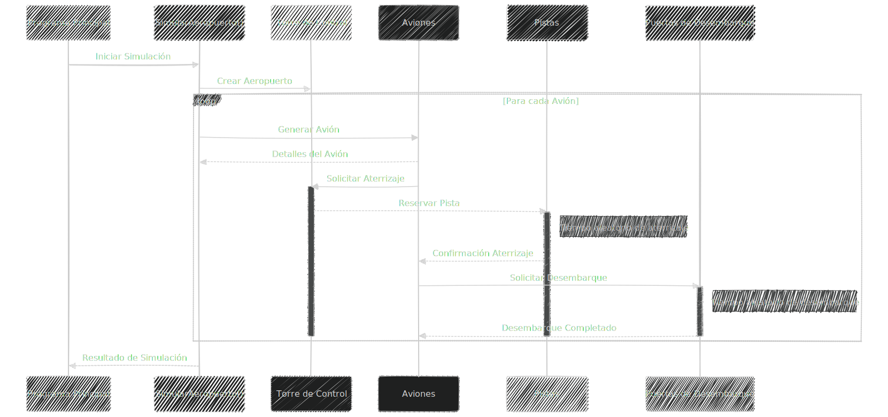
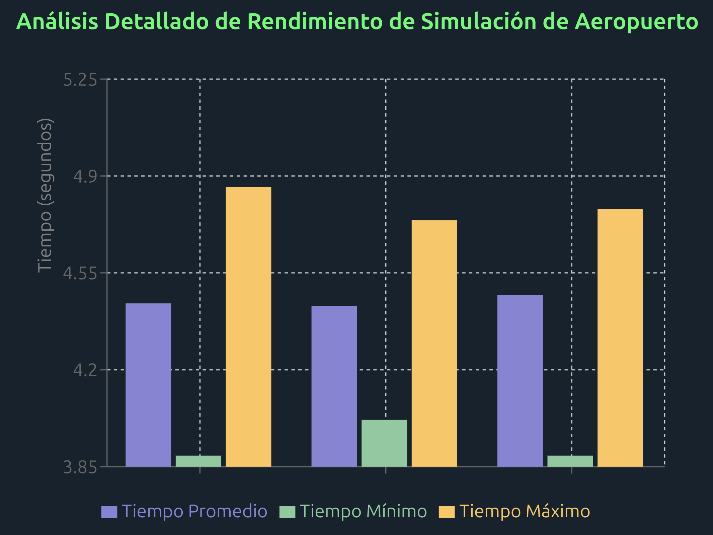

### Sistemas Distribuidos
#### Autor: Carlos Nebril (carlosnj)

 

## Índice

### [1. Descripción del Problema](#descripción-del-problema-1)

### [2. Arquitectura del Sistema](#arquitectura-del-sistema-1)
##### • [2.1 Estructura del Código](#estructura-del-código-1)
##### • [2.2 Componentes Estructurales](#componentes-estructurales-1)
##### • [2.3 Mecanismos de Concurrencia](#mecanismos-de-concurrencia-1)

### [3. Análisis de la Ejecución](#análisis-de-la-ejecución-1)
##### • [3.1 Diagrama UML de Secuencia](#diagrama-uml-de-secuencia-1)
##### • [3.2 Participantes del Diagrama](#participantes-del-diagrama-1)
##### • [3.3 Flujo de Interacciones](#flujo-de-interacciones-1)

### [4. Análisis de Rendimiento](#análisis-de-rendimiento-1)
##### • [4.1 Configuraciones de Prueba](#configuraciones-de-prueba-1)
##### • [4.2 Resultados Estadísticos](#resultados-estadísticos-1)
##### • [4.3 Gráfico de Rendimiento](#gráfico-de-rendimiento-1)

### [5. Principales Hallazgos](#principales-hallazgos-1)

### [6. Conclusiones](#conclusiones-1)

 

## 1. Descripción del Problema

Esta práctica aborda la simulación de un aeropuerto gestionando la llegada de aviones con concurrencia en el lenguaje Go. El objetivo principal es evaluar el rendimiento de la priorización por categorías y el uso eficiente de recursos limitados como pistas y puertas de desembarque.

En la simulación, una cantidad `N` de aviones llega a un aeropuerto con recursos limitados:  
- **Pistas de aterrizaje**.  
- **Puertas de desembarque**.  

Los aviones se clasifican en tres categorías:  
- **Categoría A:** Más de 100 pasajeros (Alta prioridad).  
- **Categoría B:** Entre 50 y 100 pasajeros (Prioridad normal).  
- **Categoría C:** Menos de 50 pasajeros (Baja prioridad).  

El orden de atención depende de la prioridad y la disponibilidad de recursos. El objetivo es medir el tiempo total de simulación bajo diferentes configuraciones.  

## 2. Arquitectura del Sistema

### 2.1 Estructura del Código

- 'main.go': Orquesta las simulaciones y mide los tiempos de ejecución.
- 'simulacion.go': Contiene la lógica del aeropuerto y las operaciones de aterrizaje y desembarque.
- 'simulacion_test.go': Define pruebas para validar el comportamiento del sistema.

### 2.2 Componentes Estructurales

La simulación se compone de varios componentes fundamentales que modelan un sistema de control de tráfico aéreo:

- **Avión**: 
  - Estructura que representa cada aeronave
  - Propiedades:
    - ID único
    - Categoría (A, B, C)
    - Número de pasajeros
  - Genera aleatoriamente sus características en tiempo de ejecución

- **Aeropuerto**: 
  - Gestor central de recursos
  - Componentes clave:
    - Canal de pistas limitado
    - Cola de puertas de espera
    - Mecanismo de sincronización mutex

### 2.3 Mecanismos de Concurrencia

- **Canales Go**: 
  - `pistas`: Control de ocupación de pistas
  - `puertasEspera`: Gestión de desembarque
- **WaitGroup**: Sincronización de goroutines
- **Mutex**: Protección de secciones críticas
- **Concurrencia**: Múltiples aviones procesados simultáneamente

## 3.1 Análisis de la Ejecución 

### 3.1 Diagrama UML de Secuencia

### • **Participantes del Diagrama**

#### 1. `Main`
- Punto de entrada de la aplicación
- Responsable de iniciar la simulación
- Invoca el método de simulación principal

#### 2. `SimularAeropuerto()`
- Función central que orquesta toda la simulación
- Gestiona el flujo general de la ejecución
- Crea y coordina los recursos del aeropuerto

#### 3. `Torre de Control`
- Gestor principal de los recursos
- Coordina la asignación de pistas
- Controla el flujo de aviones

#### 4. `Aviones`
- Entidades dinámicas que solicitan servicios
- Generan solicitudes de aterrizaje y desembarque
- Tienen características únicas (ID, categoría, pasajeros)

#### 5. `Pistas`
- Recurso limitado para aterrizaje
- Gestionan el tiempo y la disponibilidad de aterrizaje

#### 6. `Puertas de Desembarque`
- Recursos para procesamiento posterior al aterrizaje
- Manejan el desembarque de pasajeros

### • **Flujo de Interacciones**

#### 1. Inicio de Simulación
1. `Main` inicia `SimularAeropuerto()`
2. `SimularAeropuerto()` crea la `Torre de Control`

#### 2. Ciclo de Procesamiento de Aviones

##### Generación de Avión
1. `SimularAeropuerto()` genera un nuevo `Avión`
2. `Avión` recibe detalles aleatorios (pasajeros, categoría)

##### Solicitud de Aterrizaje
1. `Avión` solicita aterrizaje a la `Torre de Control`
2. `Torre de Control` activa el recurso de `Pista`
3. Tiempo de aterrizaje es aleatorio (simulando condiciones reales)
4. `Pista` confirma aterrizaje al `Avión`

##### Proceso de Desembarque
1. `Avión` solicita desembarque a `Puertas de Desembarque`
2. `Puerta` procesa el desembarque
3. Tiempo de desembarque es variable
4. `Puerta` confirma desembarque completado

#### 3. Ciclo de Concurrencia
1. El diagrama muestra un bucle que se repite para cada `avión`
2. Cada `avión` se procesa de manera concurrente
3. Uso de `goroutines` y `canales` para gestionar concurrencia

## 4. Análisis de Rendimiento

### 4.1 Configuraciones de Prueba

<table border="1" cellpadding="10" cellspacing="0" style="border-collapse: collapse; text-align: center; width: 100%;">
  <thead>
    <tr style="background-color: #01fb6a;">
      <th>Configuración</th>
      <th>Aviones A</th>
      <th>Aviones B</th>
      <th>Aviones C</th>
      <th>Num. Pistas</th>
    </tr>
  </thead>
  <tbody>
    <tr>
      <td>Caso Base</td>
      <td>10</td>
      <td>10</td>
      <td>10</td>
      <td>3</td>
    </tr>
    <tr>
      <td>Carga Alta</td>
      <td>20</td>
      <td>5</td>
      <td>5</td>
      <td>3</td>
    </tr>
    <tr>
      <td>Carga Baja</td>
      <td>5</td>
      <td>5</td>
      <td>20</td>
      <td>3</td>
    </tr>
  </tbody>
</table>

### 4.2 Resultados Estadísticos

#### Tiempos de Simulación (10 Ejecuciones)

<table border="1" cellpadding="10" cellspacing="0" style="border-collapse: collapse; text-align: center; width: 100%;">
  <thead>
    <tr style="background-color: #01fb6a;">
      <th>Configuración</th>
      <th>Mínimo</th>
      <th>Máximo</th>
      <th>Promedio</th>
      <th>Desviación</th>
    </tr>
  </thead>
  <tbody>
    <tr>
      <td>Caso Base</td>
      <td>3.89</td>
      <td>4.86</td>
      <td>4.44</td>
      <td>0.29</td>
    </tr>
    <tr>
      <td>Carga Alta (A prioritarios)</td>
      <td>4.02</td>
      <td>4.74</td>
      <td>4.43</td>
      <td>0.22</td>
    </tr>
    <tr>
      <td>Carga Baja (C dominante)</td>
      <td>3.89</td>
      <td>4.78</td>
      <td>4.47</td>
      <td>0.30</td>
    </tr>
  </tbody>
</table>

### 4.3 Gráfico de Rendimiento

## 5. Principales Hallazgos

1. **Consistencia del Sistema:**
   - Los resultados muestran que el sistema mantiene **tiempos promedio** muy similares (~4.45 segundos) bajo diferentes configuraciones.
   - La **variabilidad** entre ejecuciones es baja, con una desviación estándar promedio de 0.27 segundos, lo que indica estabilidad en el rendimiento.

2. **Eficiencia de Priorización:**
   - La priorización de **Categorías A** garantiza que los aviones con mayor prioridad sean atendidos rápidamente, reduciendo el impacto de cargas mixtas.
   - Las configuraciones con mayor proporción de aviones de Categoría A muestran menor varianza en los tiempos totales.

3. **Tolerancia a Cargas Variables:**
   - El sistema demuestra adaptabilidad frente a distribuciones de tráfico diferentes, manteniendo tiempos promedio similares en los escenarios de **Carga Alta** y **Carga Baja**.
   - La implementación de mecanismos concurrentes, como goroutines y canales, asegura que los recursos sean utilizados de manera eficiente incluso bajo cargas desbalanceadas.

## 6. Conclusiones

1. **Escalabilidad y Concurrencia:**
   - El diseño concurrente con goroutines, canales, y mutex permite gestionar múltiples aviones simultáneamente, logrando un **uso óptimo** de recursos limitados.
   - La arquitectura es fácilmente escalable para aumentar el número de aviones o recursos, manteniendo la estabilidad del sistema.

2. **Rendimiento Consistente:**
   - Los resultados demuestran que el sistema opera de manera consistente, con tiempos de simulación promedio estables y baja variabilidad, lo que lo hace adecuado para situaciones con **requerimientos estrictos** de tiempo.

3. **Prioridades Efectivas:**
   - La implementación de un esquema de prioridades basado en categorías mejora la gestión del tráfico aéreo, especialmente bajo **cargas mixtas**. Esto permite optimizar el tiempo total de simulación y asegura que los aviones de mayor importancia sean atendidos rápidamente.

4. **Flexibilidad:**
   - El sistema se adapta bien a diferentes escenarios de carga, mostrando su capacidad para manejar situaciones diversas sin comprometer el rendimiento. Esto lo hace ideal para aplicaciones que requieren **ajustes dinámicos** en tiempo de ejecución.

En general, la simulación cumple su propósito de evaluar el **rendimiento** en escenarios complejos, validando la eficacia de las técnicas de concurrencia y priorización implementadas en Go.

El código fuente completo de este proyecto está disponible en el siguiente repositorio: [https://github.com/cnebril2020/practica3_sistemasdistribuidos](https://github.com/cnebril2020/practica3_sistemasdistribuidos)

